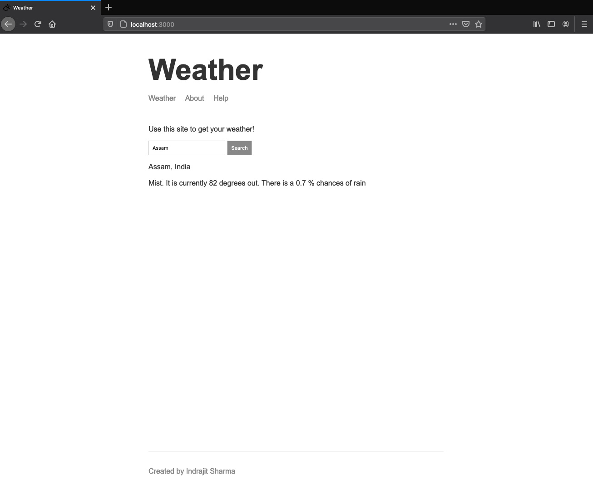

# Show some ❤️ and star the repo to support the project
# Weather-App

> The overall goal of this Node app is to get weather forecast for any location around the globe. The app first receives the address from the search bar as shown in the screenshot and uses it to Geocode its latitude and longitude using MapBox Api and then uses those latitude and longitude to get the weather forecast using WeatherStack Api.

## Screenshots



### Installation
First get your own API keys and place then in the respective forecast.js(API key from WeatherStack) and geocode.js(API key from MapBox) file.
This app requires [Node.js](https://nodejs.org/) to run.
Install the dependencies and devDependencies and start the server.

```sh
$ node app.js
```

## Extras used
 * NodeJs, HandleBars
 * [Mapbox API for Geocoding](https://www.mapbox.com/)
 * [Weather Stack API for weather forecast](https://weatherstack.com/)
